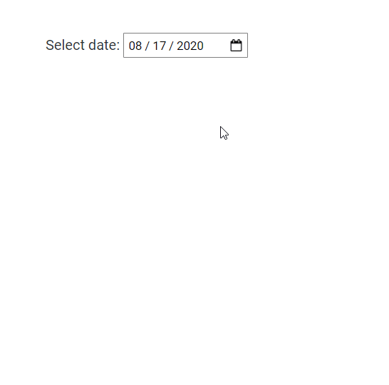

# Date Picker aka Calendar Widget

> A Simple React calendar widget or data picker

[![License][license-image]][license-url]


## [Live Demo](https://obergodmar.github.io/react-calendar)



### Props

1. `value` - Required instance of Date e.g. Date() value
2. `onChange` - Required change handler for value; accepts one argument - instance of Date
3. `isOpened` - Optional if true calendar widget will be opened by default
4. `zIndex` - Optional default = 1
5. `onOpen` - Optional Triggers when calendar widget opens
6. `onClose` - Optional Triggers when calendar widget closes

### Usage

```jsx
<CalendarInput
    value={value}
    onChange={this.handleChange}
    zIndex={2}
    onOpen={this.handleOpen}
    onClose={this.handleOpen}
    isOpened
/>
```

### Supports

* IE
* Edge
* Firefox
* Chrome
* Opera
* *Safari* - **Not tested**
